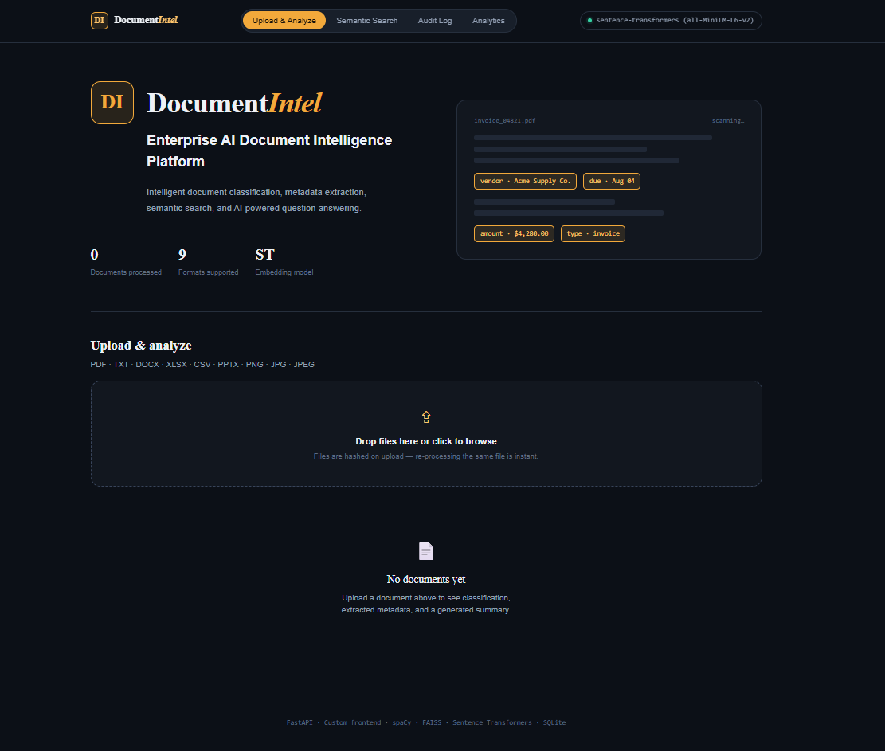
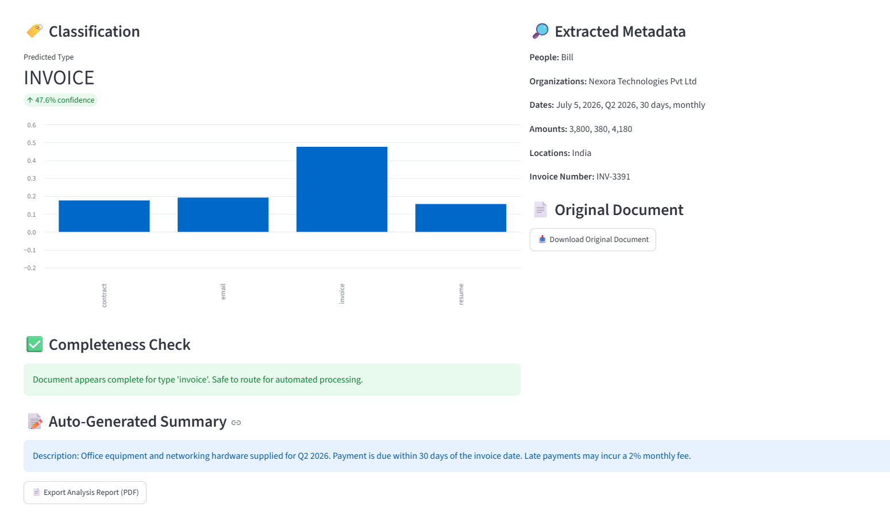
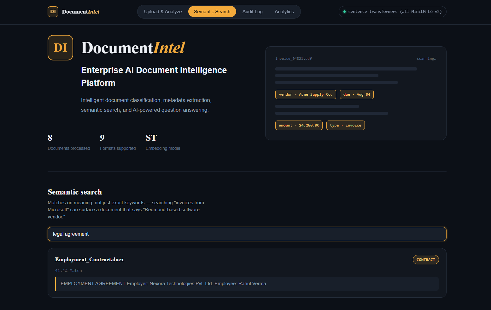
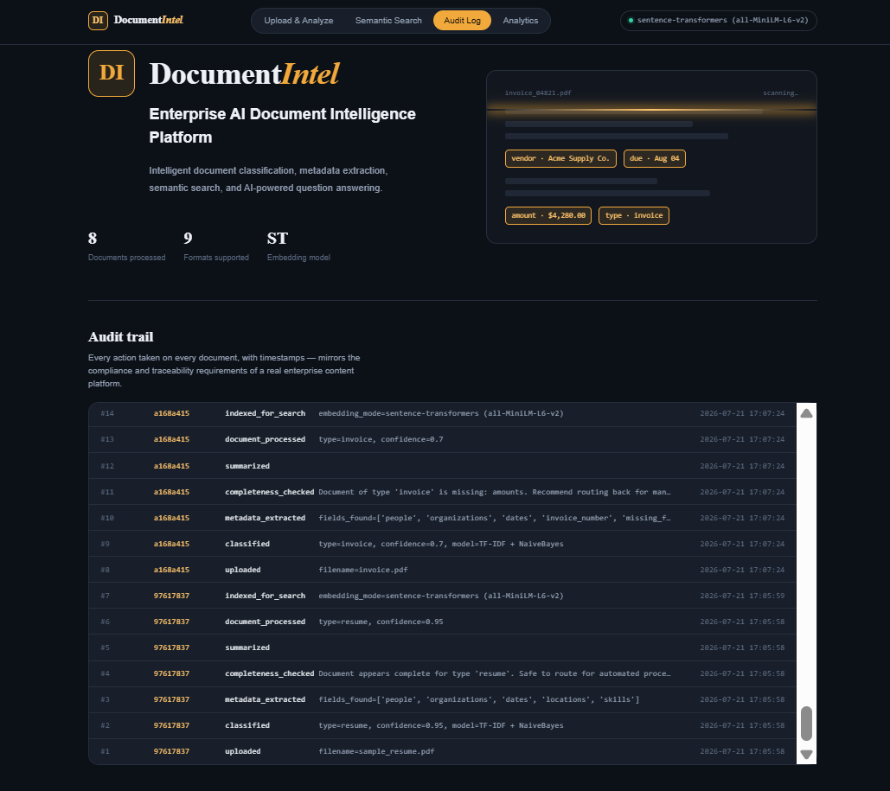
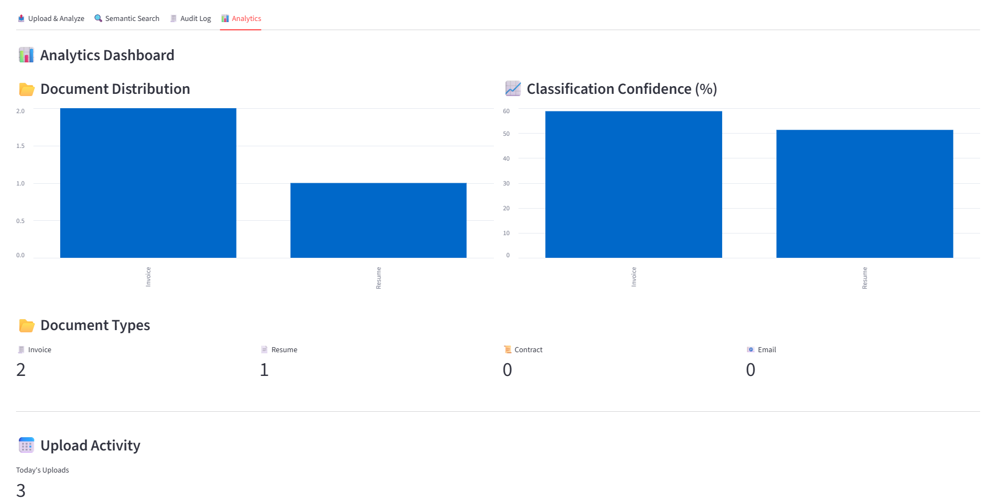

# 📄 Enterprise AI Document Intelligence Platform

### 🛠️ Built With


Enterprise AI Document Intelligence Platform is an AI-powered application designed to simplify document analysis using Natural Language Processing (NLP), Optical Character Recognition (OCR), semantic search, and a multi-agent workflow.

The platform enables users to upload documents, automatically classify them, extract important metadata, validate document completeness, generate summaries, answer questions based on document content, perform semantic search, and export detailed PDF analysis reports.

The platform combines classical machine learning, transformer-based Natural Language Processing, Optical Character Recognition, and semantic search into a unified document intelligence workflow. It is designed to showcase how enterprise document processing tasks can be automated through a scalable FastAPI backend and an interactive web interface.

---

## ✨ Features

- 📤 Upload and process PDF, DOCX, PPTX, XLSX, CSV, TXT, PNG, JPG and JPEG documents
- 🔍 OCR support for scanned PDF documents and images
- 🏷️ AI-powered document classification
- 📑 Metadata extraction using spaCy 
- ✅ Document completeness validation
- 📝 Extractive document summarization 
- ❓ Question answering over uploaded documents
- 🔎 Semantic search using FAISS
- 📊 Interactive analytics dashboard
- 🧾 Audit logging for document processing
- 📄 Export document analysis reports as PDF
- 🚫 Duplicate document detection using SHA-256 hashing
- 🗑️ Document deletion
- ⬇️ Download original uploaded document


---

## 🏗️ System Architecture

```text
Document Upload
        │
        ▼
Text Extraction / OCR
        │
        ▼
Document Classification
        │
        ▼
Metadata Extraction
        │
        ▼
Completeness Validation
        │
        ▼
Document Summarization
        │
        ▼
SQLite Storage
        │
        ▼
FAISS Vector Index
        │
        ▼
Semantic Search
        │
        ▼
Question Answering
        │
        ▼
Analytics Dashboard
```
---

## 📷 Screenshots

### 🏠 Home Dashboard




### 📄 Document Analysis




### 🔍 Semantic Search




### 🧾 Audit Log




### 📊 Analytics Dashboard




---

## 🧠 How It Works


1. Upload one or more supported documents.
2. Extract text using pdfplumber or EasyOCR for scanned PDFs and images.
3. Classify the document using a multi-agent pipeline.
4. Extract metadata using spaCy NER.
5. Validate document completeness.
6. Generate a document summary.
7. Create embeddings for semantic search.
8. Search documents or ask questions.
9. Export the analysis report as a PDF.
10. Every action is logged to a SQLite audit trail.
11. View aggregate analytics across all processed documents.

---

## 🛠️ Tech Stack

| Layer | Technologies |
|--------|--------------|
| **Programming Language** | Python |
| **Backend Framework** | FastAPI, Uvicorn, Pydantic |
| **Frontend** | HTML5, CSS3, JavaScript, Chart.js |
| **Natural Language Processing (NLP)** | spaCy, Sentence-Transformers |
| **Machine Learning** | Scikit-learn (TF-IDF, Naive Bayes, Logistic Regression) |
| **Semantic Search** | FAISS |
| **OCR & Image Processing** | EasyOCR, pdf2image, Pillow |
| **Document Processing** | pdfplumber, python-docx, python-pptx, openpyxl, pandas |
| **Database** | SQLite |
| **Report Generation** | ReportLab |
| **Numerical Computing** | NumPy |

---

## 📂 Project Structure

```text

enterprise-document-intelligence/
│
├── app/
│   ├── agents/
│   │   ├── completeness_agent.py
│   │   ├── qa_agent.py
│   │   ├── search_agent.py
│   │   └── summarizer_agent.py
│   │
│   │
│   ├── __init__.py
│   ├── classifier.py
│   ├── database.py
│   ├── embeddings.py
│   ├── extractor.py
│   ├── metadata_extractor.py
│   ├── orchestrator.py
│   ├── report_generator.py
│   ├── seed_data.py
│   ├── semantic_classifier.py
│   ├── text_utils.py
│   └── vector_index.py
│
│
├── static/
│   ├── css/
│   │   └── styles.css
│   ├── js/
│   │   ├── app.js
│   │   └── chart.umd.min.js
│   ├── favicon.ico
│   └── index.html
│
│
├── .gitignore
├── demo_ui.py           # FastAPI entry point — run this with uvicorn
├── README.md
└── requirements.txt
```

---


## 📊 Dashboard Features

- Document type distribution (bar chart)
- Classification confidence by document type
- Documents processed KPI
- Per-document classification, metadata, summary, completeness check, and Q&A — all in one view
- Full audit trail table
- One-click PDF report export and original document download

---

## ⚙️ Installation

```bash
git clone https://github.com/Shwetha8730/enterprise-document-intelligence.git

cd enterprise-document-intelligence

pip install -r requirements.txt

python -m spacy download en_core_web_sm

py -m uvicorn demo_ui:app --reload --port 8000
```
Then open **http://127.0.0.1:8000** in your browser.

---
 
## 📈 Future Enhancements

- Docker deployment
- Cloud deployment
- Per-user session isolation and authentication
- Role-based access control
- Persistent, cross-session FAISS index and document text cache
- Cloud object storage for raw document text 
- Fine-tuned transformer models for enterprise-specific document classification
- Advanced NER for domain-specific fields
- Multi-user collaboration features.

---

## 🎯 Learning Outcomes

Through this project, I gained practical experience in:

- Natural Language Processing (NLP)
- Optical Character Recognition (OCR)
- Semantic Search
- Multi-Agent AI Systems
- FastAPI REST API Development
- Frontend Development using HTML, CSS and JavaScript
- SQLite Database Design
- Enterprise Document Processing

---

## 👩‍💻 Author

**Shwethashree S**

B.Tech – Information Science & Engineering (AI & Robotics)

Presidency University, Bengaluru.

GitHub: https://github.com/Shwetha8730

---
